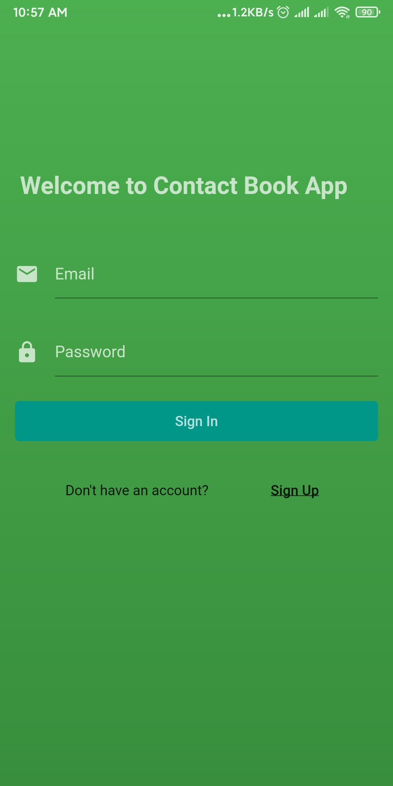
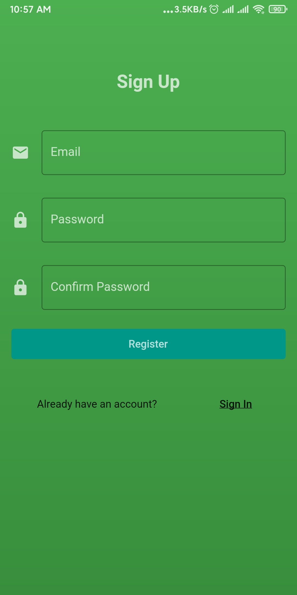
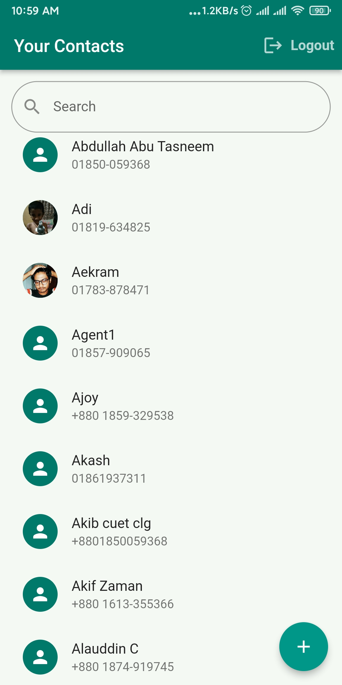
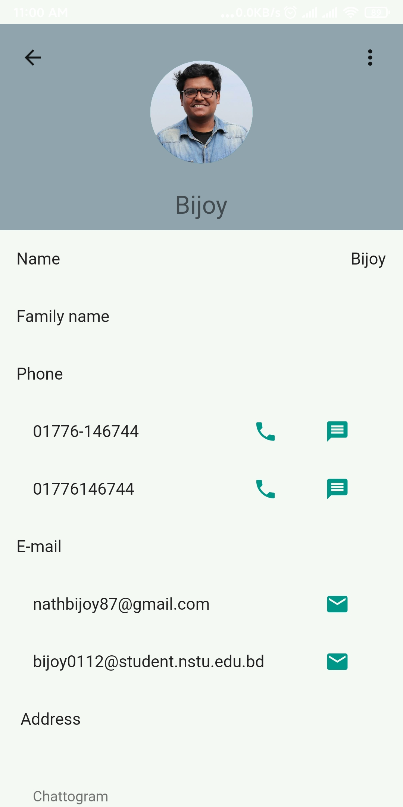
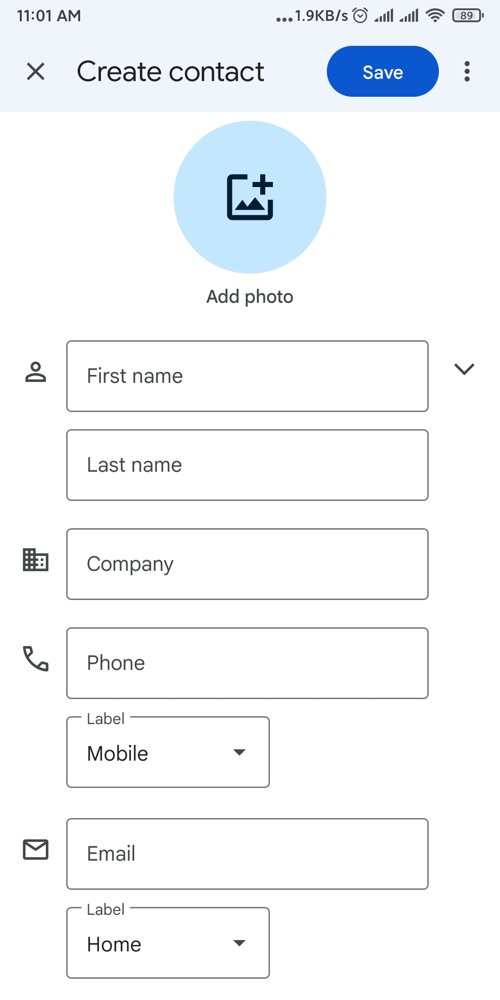
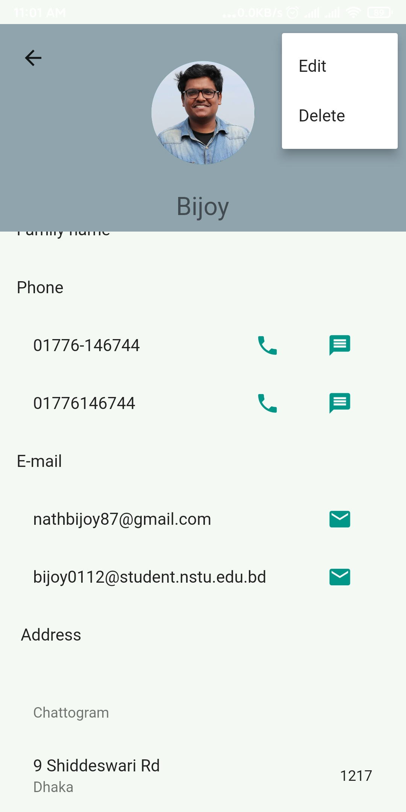

# Contact Book APP - A Futter project

Features
 - login/signup with proper validation
 - logout
 - Create, Read, Update, Delete Contact
 - user can upload photo
 - user can search their contact by name and number
 - Multiple emails, phones, addresses for individual contact
 - user can  call, message, mail from contact detail page

Note: This app need permission to read the device contacts. Click allow when the app wants permisson so that the app can run smoothly. 

# Screenshots

     
    
 

    
  

    
    

